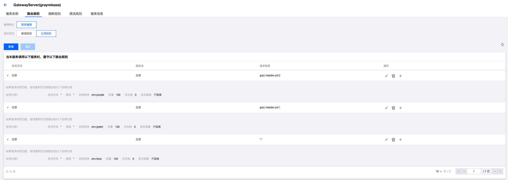

# gRPC-java-polaris Gray Release Example

English | [中文](./README-zh.md)

<!-- TOC -->
* [gRPC-java-polaris Gray Release Example](#grpc-java-polaris-gray-release-example)
  * [Project Instruction](#project-instruction)
  * [Example schema](#example-schema)
  * [How to access](#how-to-access)
    * [Start gateway service](#start-gateway-service)
    * [Start Front service](#start-front-service)
      * [Start the baseline environment (blue)](#start-the-baseline-environment--blue-)
      * [Start grayscale environment 1 (green)](#start-grayscale-environment-1--green-)
      * [Start grayscale environment 2 (purple)](#start-grayscale-environment-2--purple-)
      * [After startup](#after-startup)
    * [Start middle service](#start-middle-service)
      * [Start the baseline environment (blue)](#start-the-baseline-environment--blue-)
      * [Start grayscale environment 2 (purple)](#start-grayscale-environment-2--purple-)
    * [Start back service](#start-back-service)
      * [Start the baseline environment (blue)](#start-the-baseline-environment--blue-)
      * [Start grayscale environment 1 (green)](#start-grayscale-environment-1--green-)
    * [test](#test)
      * [Baseline environment routing](#baseline-environment-routing)
      * [Grayscale environment 1 (green) routing](#grayscale-environment-1--green--routing)
      * [Grayscale environment 2 (purple) routing](#grayscale-environment-2--purple--routing)
<!-- TOC -->

## Project Instruction

This project demonstrates how to use gRPC-java-polaris to complete the full-link grayscale of gRPC-java applications.

## Example schema


In this example, requests are distributed through the uppermost gateway, and the distribution destinations mainly involve three environments:
- Grayscale environment 1 (only for requests with uid=1), the environment identifier is env=green (green environment)
- Grayscale environment 2 (only open for requests with uid=2), the environment identifier is env=purple (purple environment)
- Baseline environment (stable business version, open for other requests), the environment identifier is env=blue (blue environment)

## How to access

### Start gateway service
1. Modify the polaris.yaml file
   - Polaris server address: grpc://127.0.0.1:8091

2. Start the router-grayrelease-gateway application

   - The IDE starts directly: find the main class `GatewayServer` and execute the main method to start the application.
   - Start after packaging and compiling: first execute `mvn clean package` to compile and package the project, and then execute `java -jar router-grayrelease-gateway-${verion}.jar` to start the application.

3. Add routing rules
   

### Start Front service

#### Start the baseline environment (blue)

1. Modify the polaris.yaml file
   - Polaris server address: grpc://127.0.0.1:8091

2. Start the router-grayrelease-frontend application

   - The IDE starts directly: find the main class `FrontendServer` and execute the main method to start the application.
   - Start after packaging and compiling: first execute `mvn clean package` to compile and package the project, and then execute `java -jar router-grayrelease-frontend-${verion}.jar blue` to start the application.

#### Start grayscale environment 1 (green)

1. Modify the polaris.yaml file
   - Polaris server address: grpc://127.0.0.1:8091

2. Start the router-grayrelease-frontend application and execute `java -jar router-grayrelease-frontend-${verion}.jar green` to start the application

#### Start grayscale environment 2 (purple)

1. Modify the polaris.yaml file
   - Polaris server address: grpc://127.0.0.1:8091

2. Start the router-grayrelease-frontend application and execute `java -jar router-grayrelease-frontend-${verion}.jar purple` to start the application

#### After startup

In the North Star console, you can see that there are 3 nodes under the gray-release-front service, and each node has a different environment ID.


### Start middle service

#### Start the baseline environment (blue)

1. Modify the polaris.yaml file
   - Polaris server address: grpc://127.0.0.1:8091

2. Start the router-grayrelease-middle application

   - The IDE starts directly: find the main class `MiddleServer`, and execute the main method to start the application.
   - Start after packaging and compiling: first execute `mvn clean package` to compile and package the project, and then execute `java -jar router-grayrelease-middle-${verion}.jar blue` to start the application.


#### Start grayscale environment 2 (purple)

1. Modify the polaris.yaml file
   - Polaris server address: grpc://127.0.0.1:8091

2. Start the router-grayrelease-middle application, and then execute `java -jar router-grayrelease-middle-${verion}.jar purple` to start the application.

### Start back service

#### Start the baseline environment (blue)

1. Modify the polaris.yaml file
   - Polaris server address: grpc://127.0.0.1:8091

2. Start the router-grayrelease-backend application

   - IDE starts directly: find the main class `BackendServer` and execute the main method to start the application.
   - Start after packaging and compiling: first execute `mvn clean package` to compile and package the project, and then execute `java -jar router-grayrelease-backend-${verion}.jar blue` to start the application.

#### Start grayscale environment 1 (green)

1. Modify the polaris.yaml file
   - Polaris server address: grpc://127.0.0.1:8091

2. Start the router-grayrelease-backend application, and then execute `java -jar router-grayrelease-backend-${verion}.jar green` to start the application.

### test

#### Baseline environment routing

````
curl -H 'uid:0' 127.0.0.1:40041/echo
````
get results
````
GatewayServer -> FrontendServer[{env=blue}] -> MiddleServer[{env=blue}] -> BackendServer[{env=blue}]
````

#### Grayscale environment 1 (green) routing

````
curl -H'uid:1' 127.0.0.1:40041/echo
````
get results
````
GatewayServer -> FrontendServer[{env=green}] -> MiddleServer[{env=blue}] -> BackendServer[{env=green}]
````

#### Grayscale environment 2 (purple) routing

````
curl -H'uid:2' 127.0.0.1:40041/echo
````
get results
````
GatewayServer -> FrontendServer[{env=purple}] -> MiddleServer[{env=purple}] -> BackendServer[{env=blue}]
````